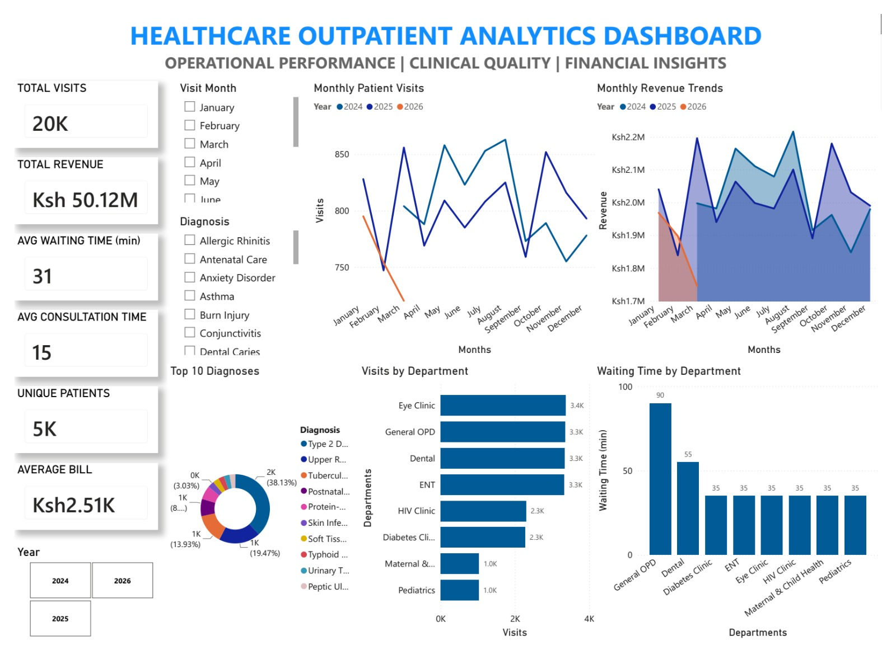
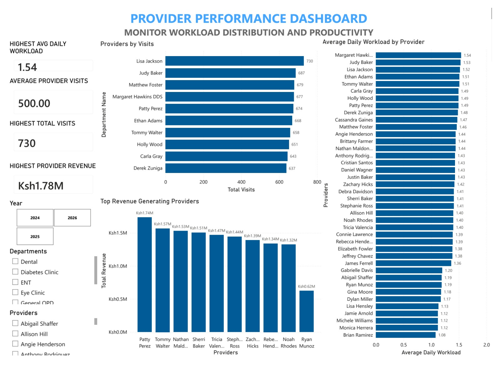
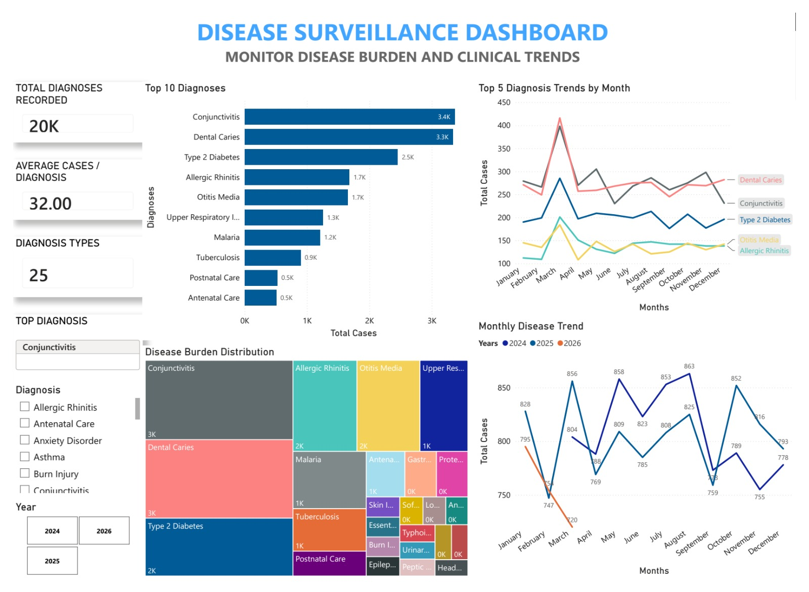
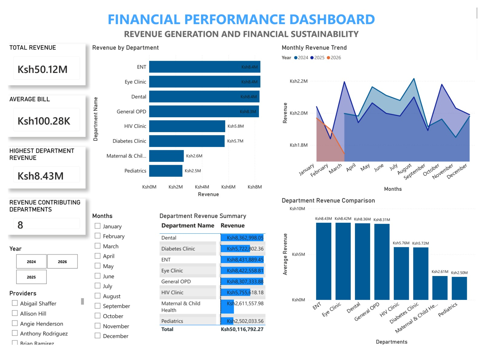
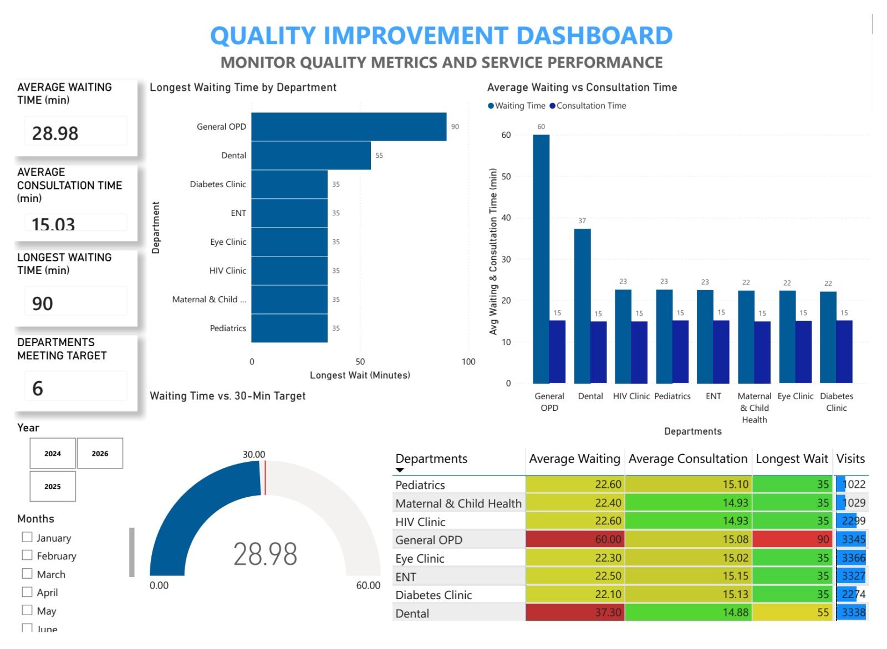

# 🏥 Healthcare Outpatient Operations & Performance Intelligence Platform

**Healthcare Data Analytics | Python · Pandas · MySQL · SQL · Power BI**

## **Overview**

Hospitals generate thousands of outpatient records daily, but this data rarely reaches decision-makers in a usable form. This project builds a complete pipeline — from synthetic data generation through to an interactive Power BI report — that turns raw outpatient records into decisions hospital managers, clinical leads, finance teams, and M&E officers can act on immediately.

## **Pipeline**

```
Synthetic Healthcare Data
        ↓
Python Data Generation (Faker)
        ↓
Pandas Cleaning & Validation
        ↓
MySQL Relational Database
        ↓
SQL Analytics Views
        ↓
Power BI Interactive Dashboard
```

## **Tech Stack**
| Tool | Role |
|---|---|
| **Python + Faker** | Synthetic outpatient data generation |
| **Pandas** | Cleaning, ETL, feature engineering |
| **MySQL** | Relational storage |
| **SQL Views** | Aggregate functions, GROUP BY, CASE statements — the analytics layer feeding Power BI |
| **Power BI** | 6-page interactive dashboard, DAX measures, conditional formatting |

## **Dataset**
- 20,000 outpatient visits · 3,000 patients · 40 providers · 8 departments · 25 diagnosis categories
- 3 reporting years (2024–2026)
- Fields: demographics, department, provider, diagnosis, visit date, waiting time, consultation time, revenue

## **Business Questions This Answers**
- Which departments have the highest patient volume and longest waits?
- Which providers carry the heaviest workload?
- Which diagnoses drive the most outpatient burden?
- Which departments generate the most revenue, and at what average bill?
- Which departments are missing service-quality targets and need intervention?

---

## 📸 **Dashboard Pages**

Each page targets a specific decision-maker and answers a real operational, clinical, or financial question.

### **1. Executive Overview**
**Audience:** Hospital leadership | **Answers:** Overall performance at a glance — visits, revenue, waiting time, and monthly trends.



---

### **2. Clinical Operations**
**Audience:** Nursing & operations managers | **Answers:** Which departments have the longest waits and heaviest consultation load.


---

### **3. Provider Performance**
**Audience:** Nursing management, HR | **Answers:** Workload distribution, productivity, and top revenue-generating providers.



---

### **4. Disease Surveillance**
**Audience:** Clinical directors, public health officers | **Answers:** Which diagnoses dominate outpatient care and how they trend month to month.



---

### **5. Financial Analytics**
**Audience:** Finance managers | **Answers:** Revenue generation, average bill, and department-level financial performance.



---

### **6. Quality Improvement**
**Audience:** Quality improvement committee | **Answers:** Which departments are meeting or missing the 30-minute waiting-time service target.



---

## **SQL Views Powering the Dashboard**
`vw_executive_summary` · `vw_monthly_trends` · `vw_department_performance` · `vw_provider_workload` · `vw_diagnosis_trends` · `vw_department_revenue` · `vw_waiting_time`

Built using aggregate functions, GROUP BY, and CASE-based categorization for waiting-time bands and service-target flags.

## **Repository Structure**
```
healthcare-outpatient-analytics-platform/
├── Data/               # raw, processed, validated CSVs
├── Notebooks/          # 01_data_generation → 05_generate_sql_inserts
├── SQL_queries/        # database setup, load, views, validation
├── PowerBI/             # .pbix and .pbit dashboard files
├── Images/              # dashboard screenshots
├── requirements.txt
└── README.md
```

## **Known Limitations (v2 Roadmap)**
- Diagnosis Trends view does not yet separate chronic vs. acute conditions.
- Provider Workload view lacks a department join, limiting cross-page filtering.
- Provider-level revenue is visit-count based; a true per-visit revenue join is planned.

## **Related Projects**
- **Hospital Readmission Risk Analytics** — readmission rate, length-of-stay, and financial exposure analysis
- **Maternal & Child Health Kenya Dashboard** — county-level maternal and child health indicators
- **Upcoming:** DHIS2 Facility Operations Intelligence Platform · React-based Healthcare Intelligence Platform

## **Author**
**Brian Mtepe** — Registered Community Health Nurse (KRCHN) | Healthcare Data Analyst
Python · SQL · Pandas · Power BI
[GitHub](https://github.com/brianmtepe) · [LinkedIn](https://www.linkedin.com/in/brianmtepe-healthdata)

---
⭐ If this project is useful to you, consider starring the repo.
